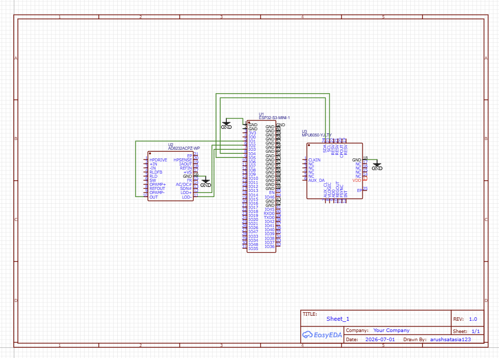

# Wearable BioSense Core (Smart-SIDS-Guardian)

High-performance, low-latency wearable telemetry system integrating an ESP32-S3 MCU with real-time biometric and kinematics acquisition pipelines. Designed for continuous infant health tracking w/ deterministic fault signaling.

## ⚡ System Highlights
* **Core:** Dual-core Xtensa 32-bit LX7 MCU running @ 240MHz w/ integrated Wi-Fi & BLE 5.0.
* **Biometrics:** AD8232 analog front-end for high-gain, low-noise ECG wave amplification.
* **Kinematics:** MPU6050 6-axis IMU over 400kHz I2C bus tracking spatial orientation.
* **Safety:** Hardwired hardware interrupt lines for real-time lead-off detection (LOD+/-).

---

## 📐 System Architecture


---

## 🛠️ Hardware Specification
* **PCB Layers:** 2-Layer FR4 | 1.6mm thickness | 1oz Copper.
* **Signal Routing:** 10mil trace width minimum for low-power digital signal lines.
* **Power Distribution:** Single-point 3.3V rail distribution w/ localized bypass decoupling capacitors per IC.
* **Communication:** Fast-mode I2C telemetry (SDA/SCL on GPIO4/5) + dedicated 12-bit SAR ADC channel (GPIO1).

---

## 💻 Firmware Architecture & Stack
* **OS:** FreeRTOS environment w/ deterministic task prioritization.
* **Task 1:** Analog sampling pipeline via DMA-driven ADC @ 250Hz (ECG processing).
* **Task 2:** I2C sensor polling pipeline @ 100Hz (6-DOF inertial kinematics processing).
* **Task 3:** Low-overhead BLE telemetry engine broadcasting condensed packet frames.

---

## 🚀 Installation & Execution

### 1. Hardware Fabrication
* Generate production files from `/hardware/gerber/`
* Flash ESP32-S3 via USB-C native JTAG interface.

### 2. Firmware Compilation
```bash
# Initialize ESP-IDF environment
. $HOME/export.sh

# Clone and navigate to codebase
git clone [https://github.com/yourusername/smart-sids-guardian.git](https://github.com/yourusername/smart-sids-guardian.git)
cd smart-sids-guardian/firmware

# Build & flash target MCU
idf.py set-target esp32s3
idf.py build flash monitor
