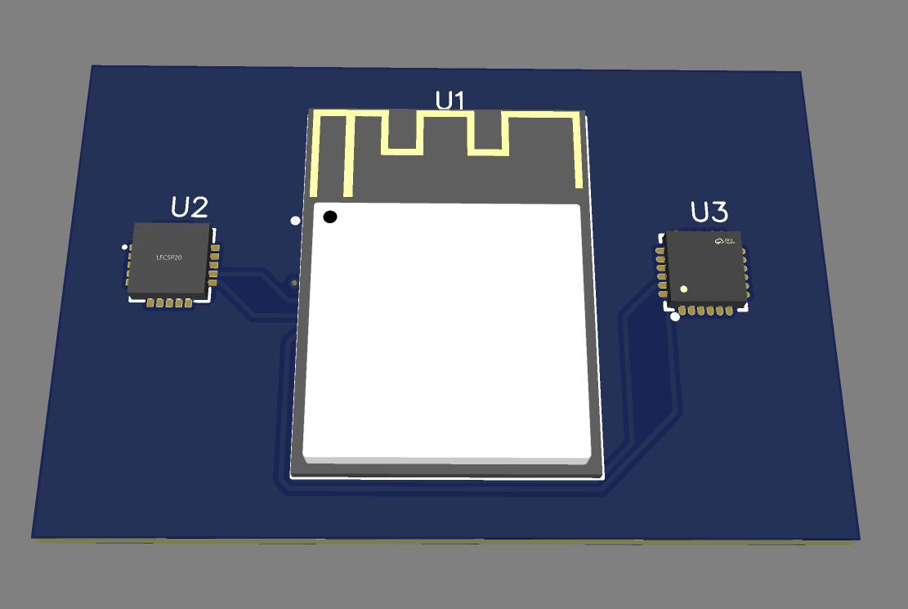

# Wearable BioSense Core (Smart-SIDS-Guardian)

A hardware/software prototype for an infant smart-romper patch designed to track heart rate and sleeping position simultaneously. The system uses an ESP32-S3 to cross-reference heart monitor waveforms with accelerometer angles to flag dangerous sleeping positions (like rolling onto the stomach) in real time.

## Operational Logic & Conditions

* **Normal Sleep State:** Stable heart rate + flat or side position -> Log baseline data over BLE.
* **Critical Alert (Prone Roll):** Sudden drop/spike in heart rate + inversion/stomach orientation -> Trigger high-priority alert.
* **Dual-Core Processing:** Core 0 runs the analog sampling loop for the heart monitor; Core 1 independently calculates the 6-DOF movement angles so the two sensors don't lag each other out.

## System Overview & Components

* **MCU:** ESP32-S3 (Dual-core Xtensa running @ 240MHz with Wi-Fi/BLE).
* **Heart Monitor:** AD8232 analog front-end chip to amplify raw ECG signals from the patch.
* **Motion Tracker:** MPU6050 6-axis IMU running over a 400kHz I2C bus to track body orientation.
* **Hardware Safety:** Uses the AD8232's hardwired Lead-Off Detection (LOD+/-) pins connected to ESP32 interrupts to instantly know if a sensor patch unglued or fell off.

---

## System Architecture


---

## Hardware Specification

* **PCB Layout:** 2-Layer FR4 board, 1.6mm thickness, 1oz Copper.
* **Traces & Pours:** 10mil trace width for digital signals, with full Top and Bottom Ground planes poured around the analog sensor lines to shield against electrical noise.
* **Pins Used:** Fast-mode I2C telemetry (SDA/SCL on GPIO4/GPIO5) and ADC channel 1 (GPIO1) for raw heart readings.



---

## Firmware Architecture (FreeRTOS)

The software is structured as an ESP-IDF project using FreeRTOS tasks to handle the timing loops:
* **Task 1 (readHeartSensor):** Runs at 250Hz (every 4ms) to pull analog values from the ADC channel.
* **Task 2 (readMotionSensor):** Runs at 100Hz (every 10ms) to poll the MPU6050 via I2C and update the tilt angles.

---

## Setting Up the Project

### 1. Hardware & Manufacturing
* Production-ready manufacturing files are located directly in the hardware directory: `/hardware/` (Contains the Gerber zip file for PCB fabrication).
* Power and flashing are handled over the native USB-C interface on the ESP32-S3.

### 2. Compiling the Code
The project uses the standard ESP-IDF build toolchain.

```bash
# Set up your local ESP-IDF environment tools
. $HOME/export.sh

# Clone the repository
git clone [https://github.com/arushsat/wearable-biosense-core.git](https://github.com/arushsat/wearable-biosense-core.git)
cd wearable-biosense-core/firmware

# Configure the target and build the binaries
idf.py set-target esp32s3
idf.py build

# Flash to your board and open the serial monitor logs
idf.py flash monitor
